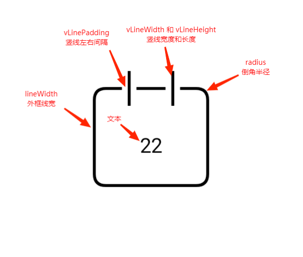

# CalendarDayIcon
[](https://jitpack.io/#zhumj/CalendarDayIcon)
## 介绍
背景是线条日历、内容是文本 的控件



## 使用
### Step 1. Add the JitPack repository to your build file
    Add it in your root build.gradle at the end of repositories:
    ```
    allprojects {
        repositories {
            ...
            maven { url 'https://jitpack.io' }
        }
    }
    ```

### Step 2. Add the dependency
    ```
    dependencies {
        implementation 'com.github.zhumj:CalendarDayIcon:Tag'
    }
    ```

## 属性
```
<declare-styleable name="CalendarDayIcon">
    // 整个大小
    <attr name="size" format="dimension"/>
    // 外框线宽度
    <attr name="lineWidth" format="dimension"/>
    // 竖线宽度
    <attr name="vLineWidth" format="dimension"/>
    // 竖线高度
    <attr name="vLineHeight" format="dimension"/>
    // 竖线左右两侧间隔
    <attr name="vLinePadding" format="dimension"/>
    // 倒角半径
    <attr name="radius" format="dimension"/>
    // 文字
    <attr name="text" format="string"/>
    // 文字大小
    <attr name="textSize" format="dimension"/>
    // 外框线颜色
    <attr name="lineColor" format="color"/>
    // 文字颜色
    <attr name="textColor" format="color"/>
</declare-styleable>
```

## 方法
```
// 设置整体大小
setSize(size: Int)
// 设置各参数
setParam(
    lineWidth: Float = this.lineWidth,
    vLineWidth: Float = this.vLineWidth,
    vLineHeight: Float = this.vLineHeight,
    vLinePadding: Float = this.vLinePadding,
    radius: Float = this.radius,
    text: String = this.textStr,
    textSize: Float = this.textSize,
    @ColorInt lineColor: Int = this.lineColor,
    @ColorInt textColor: Int = this.textColor
)
```
